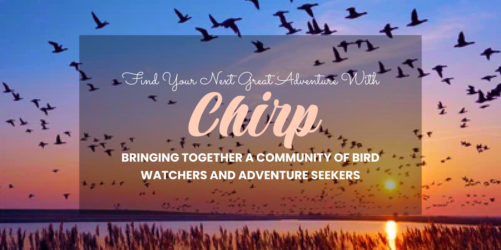

# Chirp - The Social Media Platform

)

## Problem Statement
Have you ever been told to touch grass? Encouraged to go explore nature? Tired of staring at your computer all day? Looking for something fun, inexpensive and can be done anywhere, anytime? Then, you can’t go wrong with some bird watching! The bird watching community is huge and a lot of enthusiasts do it purely for fun by ”keeping a life list - a birding term for the running list of all the different birds they see.” 

However, keeping in touch with the bird watching community and finding people who enjoy this hobby just as much as you do is incredibly difficult especially as a newcomer just wanting to learn more about bird watching or birding veterans wanting to share all the awesome adventures they’ve been on. What if we brought the community together through a social media app made just for birdwatchers? 

**Our app, Chirp, brings that community aspect by encouraging bird enthusiasts to share posts about their birds, learn new things, find the best places to bird watch, and participate in events made just for the community! Let’s make bird watching a hobby for everyone!**

## Explore Chirp's Future Features
- **Designing recognizable Interfaces** : Offers a design similar to other social media apps so it remains accessible for all age ranges

- **Bringing community together** : Bringing a social aspect to bird watching - finding a community, sharing with friends , setting up birding meetups

- **Integration With Artificial Intelligence** : Making bird identification easier for all users through different photos so users can add them to their collection of birds found ~ ( Prospective Feature in future iterations of Chirp )

- **Expanding the Community** : Reaching out to not only vetern Bird Watching Enthusiasts but encouraging younger demographics to join the fun as well!

- **Encourage Environment Awareness** : Encouraging awareness and discussions on how to protect our environment, environmental conservation topics, and so much more!

# Chirp's Tech Architecture
Chirp is currently being developer using the **MERN stack** which allows the platform to have more flexibility in terms of integrating third party lagnuages, frameworks, or software and a larger opportunity to scale the app in future interations with consideration of potential mobile application development of the Chirp platform.

**Development Timeline: Long-Term Project with projected MVP to be completed within 6 months (maybe extended based on project and member vote)**

Our Languages: 
[![React][React.js]][React-url]
[![Mongo][MongoDB]][Mongo-url]
[![Express][Express.js]][Express-url]
[![Node][NodeJS]][Node-url]

Other Software Platforms Being Used:
[![MUI][MUI]][MUI-url]
[![Figma][Figma]][Figma-url]
[![NPM][NPM]][NPM-url]
[![HTML5][HTML5]][HTML-url]
[![Javascript][Javascript]][Javascript-url]

<!--MARKDOWN LINKS-->
[React.js]: https://img.shields.io/badge/React-20232A?style=for-the-badge&logo=react&logoColor=61DAFB
[React-url]: https://reactjs.org/
[MongoDB]: https://img.shields.io/badge/MongoDB-%234ea94b.svg?style=for-the-badge&logo=mongodb&logoColor=white
[Mongo-url]: https://www.mongodb.com/
[Express.js]: https://img.shields.io/badge/express.js-%23404d59.svg?style=for-the-badge&logo=express&logoColor=%2361DAFB
[Express-url]: https://expressjs.com/
[NodeJS]: https://img.shields.io/badge/node.js-6DA55F?style=for-the-badge&logo=node.js&logoColor=white
[Node-url]: https://nodejs.org/en/about
[MUI]: https://img.shields.io/badge/MUI-%230081CB.svg?style=for-the-badge&logo=mui&logoColor=white
[MUI-url]: https://mui.com/material-ui/
[Figma]: https://img.shields.io/badge/figma-%23F24E1E.svg?style=for-the-badge&logo=figma&logoColor=white
[Figma-url]: https://www.figma.com/
[NPM]: https://img.shields.io/badge/NPM-%23CB3837.svg?style=for-the-badge&logo=npm&logoColor=white
[NPM-url]: https://www.npmjs.com/
[HTML5]: https://img.shields.io/badge/html5-%23E34F26.svg?style=for-the-badge&logo=html5&logoColor=white
[HTML-url]: https://developer.mozilla.org/en-US/docs/Learn/Getting_started_with_the_web/HTML_basics
[JavaScript]: https://img.shields.io/badge/javascript-%23323330.svg?style=for-the-badge&logo=javascript&logoColor=%23F7DF1E
[JavaScript-url]: https://www.javascript.com/